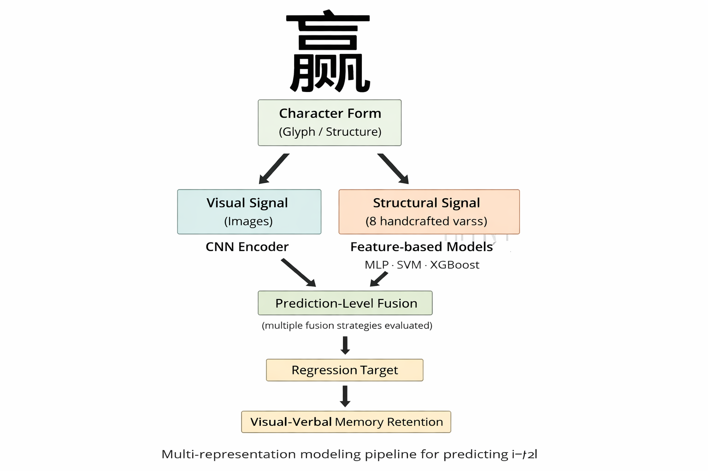
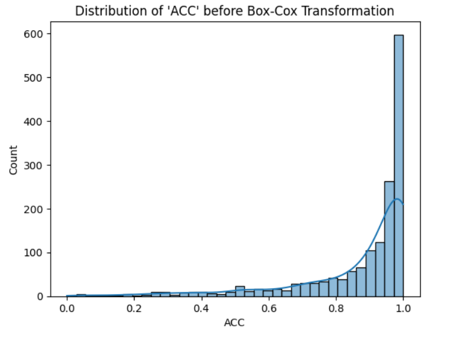
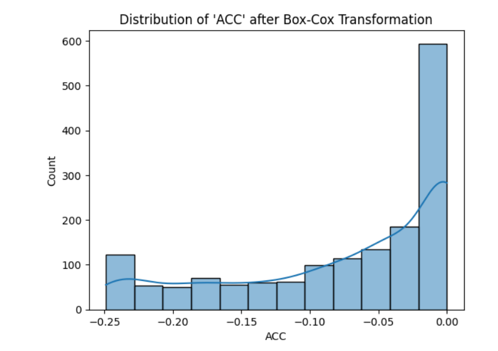
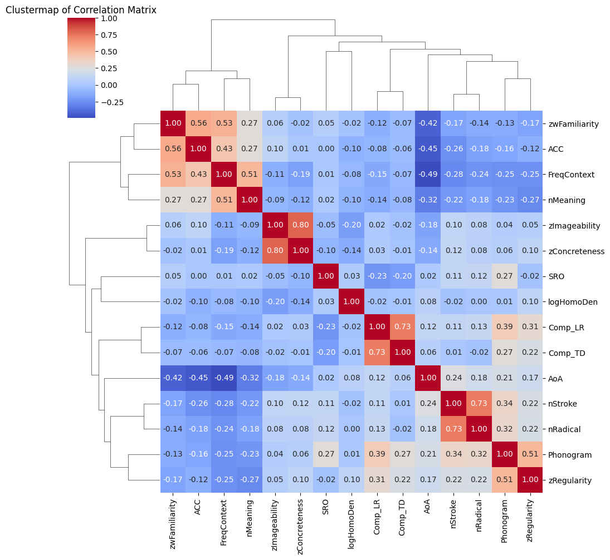

# 🧠 What Makes Chinese Characters Memorable?
### 📊 A Data Science Case Study on Human Memory Retention

---

## ✨ Project Snapshot

> **This project investigates what makes Chinese characters easier or harder to remember,  
using data-driven analysis, interpretability techniques, and error diagnostics.**

🔍 **Focus**: Data understanding & insight  
🚫 **Not** a model competition  
🎯 **Audience**: Data Analyst / Data Scientist / Analytics roles

---

## 🚀 Why This Project Matters

✔️ Real-world, **human-behavior data**  
✔️ Strong **distributional challenges**  
✔️ Emphasis on **interpretability over raw performance**  
✔️ Clear demonstration of **analytical reasoning**

---

## ❓ Core Questions

- 🧩 **How is memory retention distributed across characters?**
- 📈 **Which feature types truly matter?**
- 🧠 **Does visual complexity explain memorability?**
- ⚠️ **Where do predictive models systematically fail?**

---

## 🗂️ Data Overview

📦 **Samples**: ~1,600 Chinese characters  
🎯 **Target**: Memory retention score (**ACC**, bounded 0–1)

### 🔎 Feature Categories
- 📊 **Frequency & familiarity**
- 🧠 **Psycholinguistic features**
- 🧩 **Structural complexity**
- 🖼️ **Image-based visual representations**

---

## 🔄 Analytical Workflow

**End-to-end structure**  
➡️ Data inspection  
➡️ Exploratory analysis  
➡️ Feature relationships  
➡️ Model validation  
➡️ Error analysis  

---

## 📈 Target Variable Analysis

### 🔹 ACC Distribution (Raw)

**🔍 Observation**
- Strong **right-skew**
- Clear **ceiling effect**

**📌 Why it matters**
> Classical modeling assumptions do not hold.  
> Understanding the data is more important than chasing metrics.

---

### 🔹 ACC After Box–Cox Transformation

**Insight**
- Transformation improves numerical stability  
- **Data imbalance remains intrinsic**

---

## 🔗 Feature Relationships

### 🧠 Correlation Structure

**Key Insight**
> **Experience-related features** (frequency, familiarity, AoA)  
> dominate over **raw visual complexity**.

📌 Structural features show **internal redundancy**.

---

## 🧩 Character Complexity Stratification

Characters are grouped into:
- 🟢 **Simple**
- 🔴 **Complex**

➡️ Enables **error stratification** and diagnostic analysis.

---

## 🤖 Model Performance (High-Level)

### 📊 What We Learn
✔️ Feature-based models outperform image-only models  
✔️ CNN-only performance is **very limited**  
✔️ Fusion adds **marginal gains at best**

> **Models are validation tools — not the main narrative.**

---

## ⚠️ Error Analysis

### 🔍 True vs. Predicted ACC

**Observation**
- Errors increase for **low-retention** characters  
- Clear **heteroscedasticity** with complexity

---

### 📉 Residual Distribution

**Insight**
- Residuals are centered  
- Slight skew reflects **imbalanced learning difficulty**

---

## 🧠 Model Interpretation (Best Model)

### ⭐ SHAP Feature Importance

**Top Drivers of Memorability**
1. **Frequency in context**
2. **Familiarity**
3. **Age of acquisition**
4. **Stroke count (secondary)**

> **Interpretability reveals more than accuracy metrics.**

---

## 🧠 Key Takeaways

✅ Memory retention data is **highly skewed and bounded**  
✅ **Data understanding > model complexity**  
✅ Interpretability explains *why*, not just *how well*  
✅ Error analysis is essential for responsible modeling  

---

## 🛠️ Tools & Stack

🧪 Python  
📊 pandas · numpy  
📈 matplotlib · seaborn  
🤖 scikit-learn · PyTorch  
🔍 SHAP  

---

## 📌 Notes

This project is adapted from a **Master’s thesis**.  
The GitHub version is intentionally **market-facing**,  
prioritizing **clarity, insight, and interpretability** over academic completeness.

---

⭐ *If you work in data, this is what “thinking with data” looks like.*

